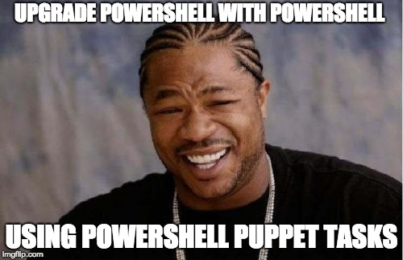
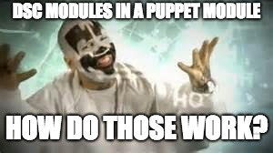
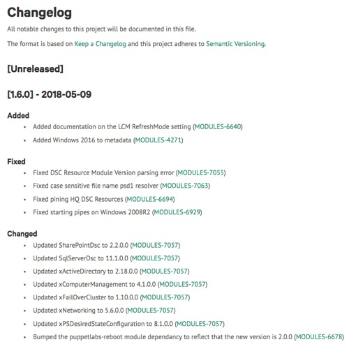
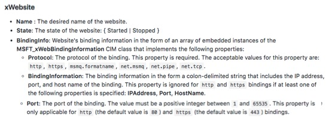
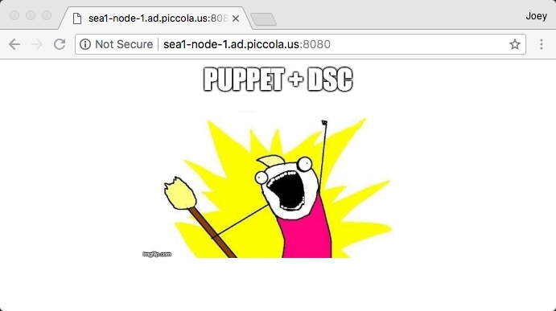

## @color[#2e75e8](PowerShell) + @color[#FE9F17](Puppet)
### Tasks, Chocolatey, DSC

---

## Agenda

- Puppet Tasks with PowerShell
- Upgrade PowerShell with Tasks & Chocolatey
- Desired State Configuration (DSC)

---

#### Puppet Tasks

@ol[](false)
- Tasks are single actions that you run on target machines in your infrastructure.
- Best for changes that aren’t about enforcing the state of machines.
- You can write tasks in any programming language that can run on the target nodes.
- Tasks can be chained together into Plans (not covered today).
@olend

---

#### Anatomy of a Task

@ul[](false)
- Reside in $module\Tasks
- Task file (PowerShell, Ruby, Bash, etc)
- Metadata .json file [optional]
@ulend

```
C:\gits\kms_win [master ≡]> tree /F tasks
  C:\GITS\KMS_WIN\TASKS
    ├──slmgr_ato.json
    ├──slmgr_ato.ps1
    ├──slmgr_ipk.json
    └──slmgr_ipk.ps1
```
@[3-4](Example task 1.)
@[5-6](Example task 2.)

---

#### Anatomy of a Task cont...

```
C:\gits\control-repo > tree /F .\site\powershell_tasks
  C:\gits\control-repo\site\powershell_tasks
    ├── disablesmbv1.json
    ├── disablesmbv1.ps1
    ├── getkb.json
    ├── getkb.ps1
    ├── testconnection.json
    ├── testconnection.ps1
    ├── wuauclt.json
    ├── wuauclt.ps1
    └── logoffusers.ps1
```
@[2](Location for tasks directly in control-repo)
@[3-4](Example task 1.)
@[5-6](Example task 2.)
@[7-8](Example task 3.)
@[9-10](Example task 4.)
@[11](Example task 5.)

---

@title[Task Metadata (slmgr_ipk.json)]

<p><span class="slide-title">Task Metadata (slmgr_ipk.json)</span></p>

@size[.7em](Task metadata files describe task parameters, validate input, and control how the task runner executes the task.)

```json
{
    "puppet_task_version": 1,
    "description": "A task for installing a windows product key with slmgr.vbs.",
    "input_method": "powershell",
    "parameters": {
        "activation_key": {
            "description": "The activation key to be installed via slmgr.vbs /ipk.",
            "type": "String"
        }
    }
}
```

---

@title[Task File (slmgr_ipk.ps1)]

<p><span class="slide-title">Task File (slmgr_ipk.ps1)</span></p>

```powershell
Param(
    [Parameter(Mandatory=$True)]
    [String]$activation_key
)
cscript.exe C:\Windows\System32\slmgr.vbs /ipk $activation_key
```

---

#### Tasks Demo

@ol[](false)
- slmgr
- SMBv1
- testconnection
@olend

---

#### Upgrade PowerShell with Tasks & Chocolatey



---

#### Prerequisites

@ol[](false)
- chocolatey installed
- package_inventory_enabled = true
@olend

---

#### Tasks & Chocolatey Demo

```
Inventory: inventory[certname] { facts.powershell_version = "4.0" }
Task parameters:
  action: upgrade
  name: powershell
  provider: chocolatey
  version: 5.1.14409.20180105
```

---

#### Puppet & DSC

@ol[](false)
- Manages all the bad parts about DSC.
  + DSC module distribution
  + Initial LCM configuration
  + Version control
  + High availability
- Still requires PowerShell v5.0
@olend

---

#### DSC Modules?



---

#### DSC Modules



---

#### Syntax

<p><span class="slide-title">Traditional DSC</span></p>

```powershell
WindowsFeature IIS {
  Ensure = 'present'
  Name   = 'Web-Server'
}
```

<p><span class="slide-title">Puppet DSC</span></p>

```powershell
dsc_windowsfeature {'IIS':
  dsc_ensure => 'present',
  dsc_name   => 'Web-Server',
}
```
---

<p><span class="slide-title">DSC demo resources</span></p>

```powershell
dsc_windowsfeature {'IIS':
  dsc_ensure => 'present',
  dsc_name   => 'Web-Server',
}

dsc_windowsfeature {'AspNet45':
  dsc_ensure => 'present',
  dsc_name   => 'Web-Asp-Net45',
}

dsc_windowsfeature {'console':
  dsc_ensure => 'present',
  dsc_name   => 'Web-Mgmt-Console',
}

dsc_xwebsite {'Stop DefaultSite':
  dsc_ensure       => 'present',
  dsc_name         => 'Default Web Site',
  dsc_state        => 'Stopped',
  dsc_physicalpath => $defaultwebsitepath,
}

dsc_file {'tmp folder':
  dsc_ensure          => 'present',
  dsc_type            => 'Directory',
  dsc_destinationpath => $zippath,
}

dsc_xremotefile {'Download website Zip':
  dsc_destinationpath => $zipfile,
  dsc_uri             => $zipuri,
}

dsc_archive {'Unzip and Copy the website':
  dsc_ensure      => 'present',
  dsc_path        => $zipfile,
  dsc_destination => $destinationpath,
}

dsc_xwebsite {'LetsDoThis':
  dsc_ensure       => 'present',
  dsc_name         => $websitename,
  dsc_state        => 'Started',
  dsc_physicalpath => $destinationpath,
  dsc_bindinginfo  => [
                        {
                          protocol => 'http',
                          port     => 8080,
                        }
                      ],
}
```

@[1-4]
@[6-9]
@[11-14]
@[16-21]
@[23-27]
@[29-32]
@[34-38]
@[40-51]

---



```powershell
dsc_xwebsite {'LetsDoThis':
  dsc_ensure       => 'present',
  dsc_name         => $websitename,
  dsc_state        => 'Started',
  dsc_physicalpath => $destinationpath,
  dsc_bindinginfo  => [
                        {
                          protocol => 'http',
                          port     => 8080,
                        }
                      ],
}
```
@[6-11]
@[7-10]

---

#### Puppet DSC Demo

lets make a website.

---

#### Puppet DSC Demo

we did it!
[code located at this gist.github](https://gist.github.com/joeypiccola/51efedc0d73ba220ee77e170e6bf04e4)



---

#### DSC Lite


---

#### DSC Comparison


---

### Questions?

<br>

@fa[twitter](joeypiccola)

@fa[github](joeypiccola)

@fa[wrench](forge.puppet.com/jpi)

@fa[envelope-square](joey@joeypiccola.com)
